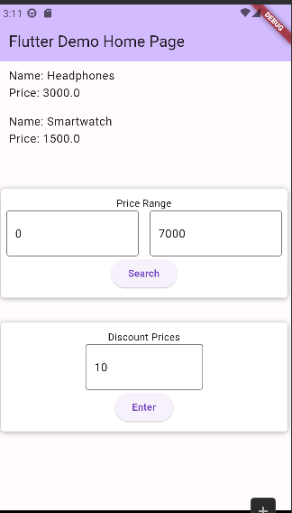

# Flutter Dev Technical Exam 3- Data Manipulation

Given the data below, create the following functions:

- Price range filter – a function that accepts two integers as price range and returns a list of specific products that matches the price range criteria.
- Apply discounted price – a function that accepts integer as percentage discount and returns a list of all products with their respective new discounted price based on the inputed percentage discount.

Data:

class Product {
  final String name;
  final double price;
  Product(this.name, this.price);
}

List<Product> productList = [
    Product('Smartphone', 12000),
    Product('Laptop', 60000),
    Product('Headphones', 3000),
    Product('Tablet', 7000),
    Product('Smartwatch', 1500),
  ];

